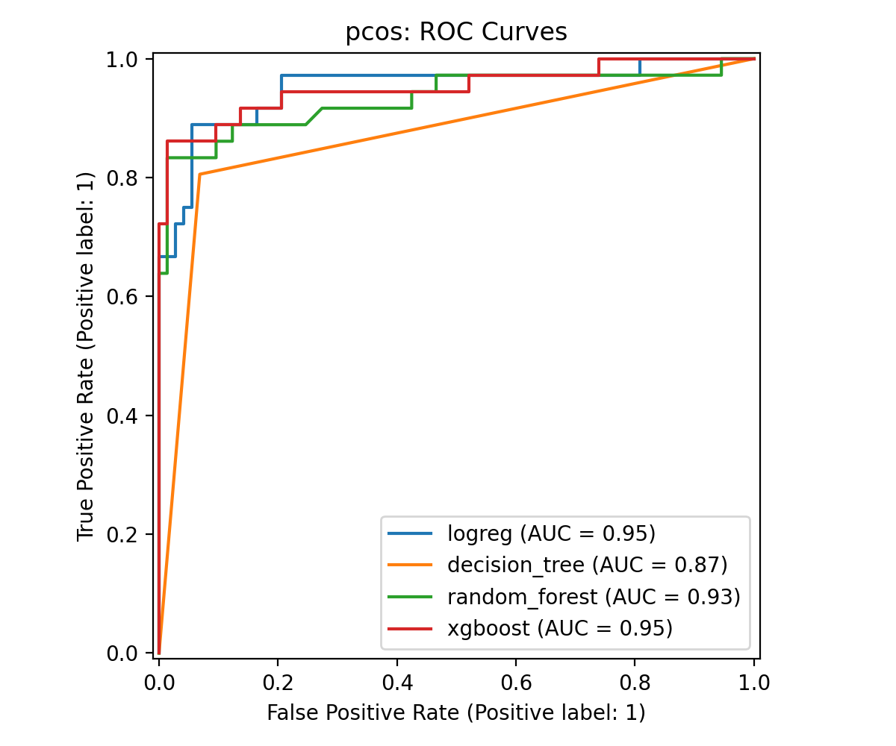
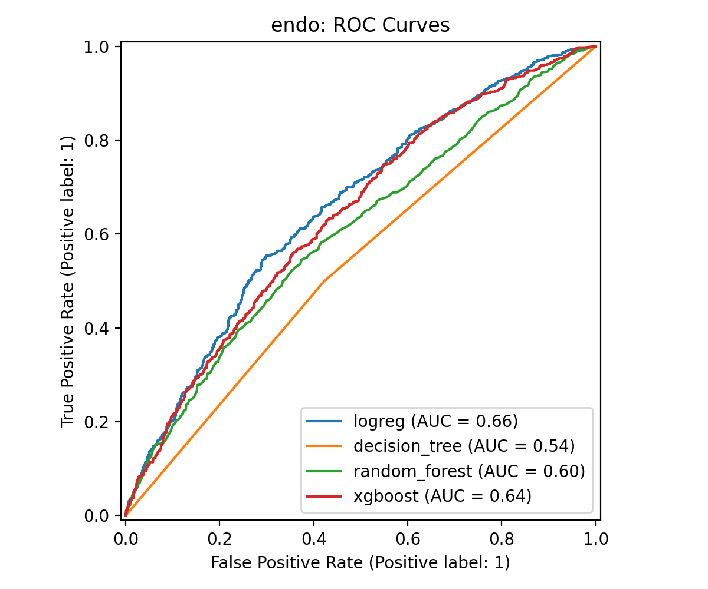
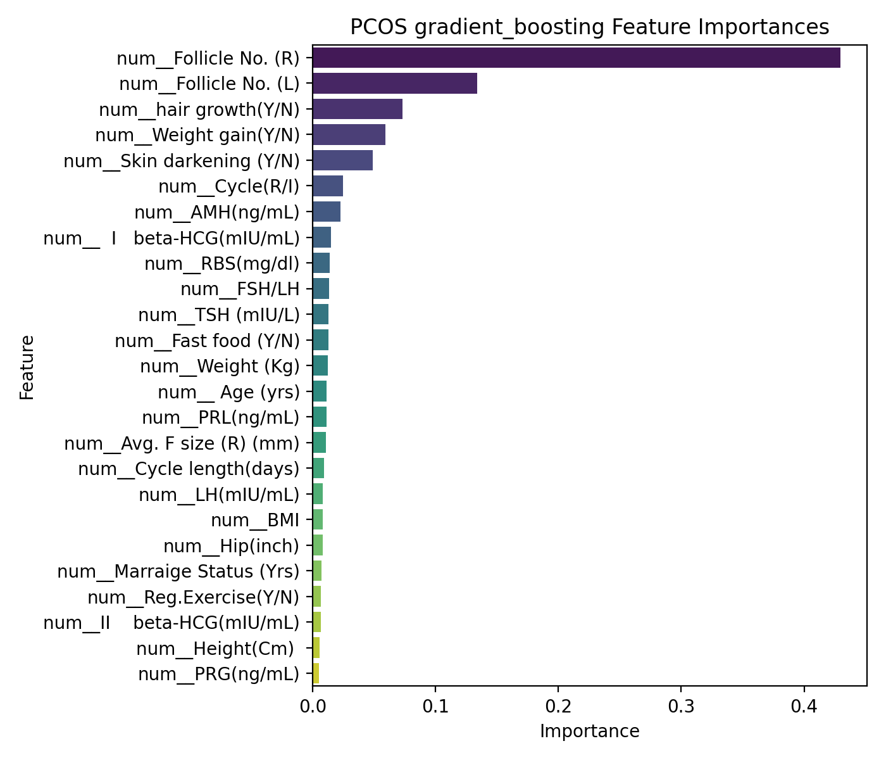
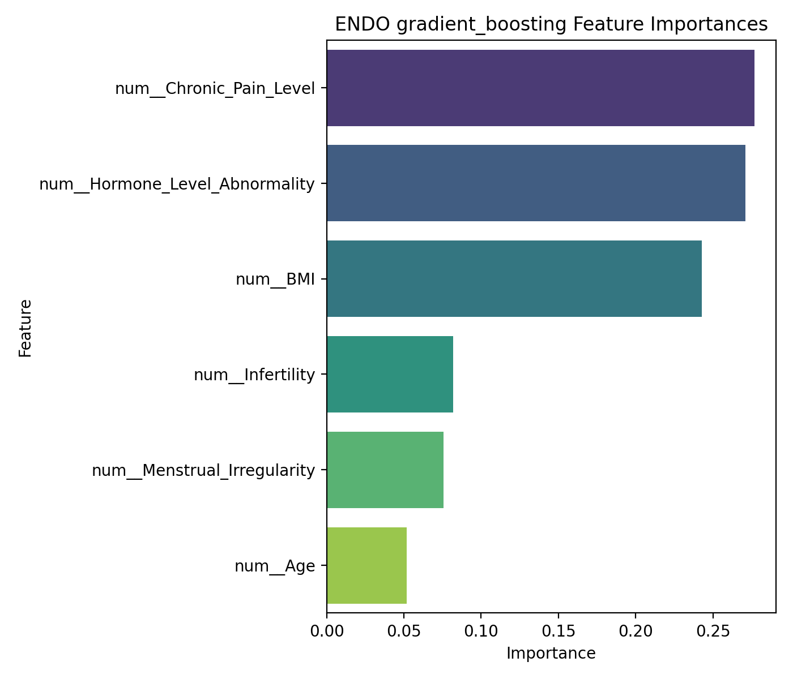

# EndowHer Mining

EndowHer Mining is a ML/DM workflow for exploring predictive modeling on two women’s health conditions:

- **PCOS (Polycystic Ovary Syndrome)**
- **Endometriosis**

The project includes data preprocessing, model training, evaluation, feature importance analysis, cross-dataset feature comparison, and result summarization through notebooks and runnable scripts.

## Project goals

This project was built to:

- compare machine learning performance across PCOS and endometriosis datasets,
- identify the most influential predictors for each condition,
- generate reproducible evaluation outputs (metrics, plots, tables, summaries),
- support further research for symptom-based and clinical ML applications in women’s health.

## Repository structure

```text
endowher-mining/
├─ data/
│  ├─ metadata/
│  ├─ processed/
│  ├─ raw/
├─ models/
├─ notebooks/
├─ reports/
│  ├─ figures/
│  ├─ summary/
│  └─ tables/
├─ scripts/
├─ src/
├─ tests/
├─ .gitignore
├─ pyproject.toml
├─ README.md
└─ requirements.txt
```

## Workflow

The project follows this workflow:

1. **Data understanding**  
   Explore raw PCOS and endometriosis datasets.

2. **Preprocessing**  
   Clean inputs, split train/test sets, and prepare features for modeling.

3. **Modeling**  
   Train and evaluate:
   - Logistic Regression
   - Decision Tree
   - Random Forest
   - Gradient Boosting
   - XGBoost

4. **Feature comparison**  
   Compare the most influential features across PCOS and endometriosis.

5. **Results summary**  
   Save metrics, plots, and short Markdown summaries.

## Notebooks

- `01_data_understanding.ipynb`
- `02_preprocessing.ipynb`
- `03_modeling_pcos.ipynb`
- `04_modeling_endo.ipynb`
- `05_feature_comparison.ipynb`
- `06_results_summary.ipynb`

## Scripts

The same workflow can also be run through scripts:

- `run_preprocessing.py`
- `run_train_pcos.py`
- `run_train_endo.py`
- `run_compare_features.py`
- `run_make_report.py`
- `run_all.py`

Run the full pipeline with:

```bash
python -m scripts.run_all
```

## Results

### Overall model comparison

Saved in:

- `reports/tables/model_metrics.csv`
- `reports/summary/pcos_results.md`
- `reports/summary/endo_results.md`

### Best observed performance

#### PCOS
The PCOS models performed strongly overall. In the combined metrics table, the top-performing models achieved ROC-AUC values around **0.95**, with high accuracy, precision, recall, and F1-score.

From the summary output:
- Accuracy: **0.8899**
- Precision: **0.8000**
- Recall: **0.8889**
- F1: **0.8421**
- ROC-AUC: **0.9513**

#### Endometriosis
Endometriosis was substantially more difficult to predict with the available structured features. The best endometriosis result in the summary used logistic regression, with only modest discrimination.

From the summary output:
- Accuracy: **0.6095**
- Precision: **0.5172**
- Recall: **0.6434**
- F1: **0.5735**
- ROC-AUC: **0.6575**

### Interpretation

A key finding of this project is that **PCOS appears much more predictable than endometriosis** from the available tabular clinical/symptom data.One likely reason is that the PCOS dataset contains a richer and wider feature space, while the endometriosis dataset is limited to a small number of high-level variables.

## Feature importance

### PCOS
The most important PCOS predictors include:

- Follicle number (right)
- Follicle number (left)
- Hair growth
- Weight gain
- Skin darkening

These are clinically meaningful and align well with common PCOS-related markers.

### Endometriosis
The most important endometriosis predictors include:

- Hormone level abnormality
- Infertility
- Menstrual irregularity
- Chronic pain level
- BMI
- Age

The feature importance distribution suggests that the endometriosis models rely heavily on a very small set of variables, which may partly explain the lower predictive performance.

## Example figures

### PCOS ROC curves



### Endometriosis ROC curves



### PCOS Gradient Boosting Feature Importance



### Endometriosis Gradient Boosting Feature Importance



## Output files

### Figures
Stored in `reports/figures/`, including:
- ROC curves
- confusion matrices
- feature importance plots

### Tables
Stored in `reports/tables/`, including:
- per-model metrics for PCOS and endometriosis,
- combined model comparison table,
- feature importance tables,
- shared feature comparison table

### Summaries
Stored in `reports/summary/`, including:
- `pcos_results.md`
- `endo_results.md`

## Installation

Create an environment and install dependencies:

```bash
python -m venv .venv
source .venv/bin/activate
pip install -r requirements.txt
```

## Notes

This repository is intended as a research and workflow project for comparative ML analysis in women’s health. It is not a clinical diagnostic tool.
